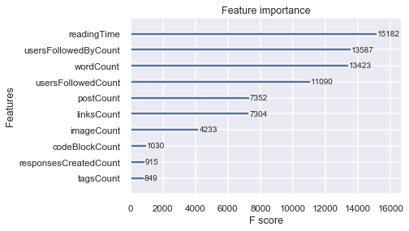

# Medium Popularity Prediction

## Outline

Dataset Introduction

EDA

KNN, Random Forest and XGboost (Final Model)

Conclusion

Future Exploration

## Project Goal
The goal of this project is to determine whether a giving post on Medium will be popular or not.

## Data Collection

The data was collected from Kaggle, originally web scrapped on Medium by Aiswarya. Important features among 50 initial independent variables include:
  -  collectionId
  -  codeBlockCount
  -  imageCount
  -  readingTime
  -  recommends
  -  totalClapCount
  -  wordCount
  -  usersFollowedByCount
  -  usersFollowedCount
## EDA

The above graphic shows recommend counts vs. populatity.

The above graphic shows average reading time vs. populatity.

The above graphic shows follower counts vs. populatity.

## Data Cleaning

Many columns were dropped because of contents unrelated to popularity or contain strings or date time. There is no missing values in this data. After random sampling 100,000 observations and removing outliers, this project resulting in a total of 12 features and 99,955 samples.

## Feature Engineering

-  Feature Selection
-  Train Test Split
-  Oversampling
-  Data Standardization (StandardScaler)

## Model & Results

Models used were KNN, Random Rorest, and XGboost. XGboost performed with best F1 score: 0.87 and best Accuracy: 0.95.

## Model Conclusion

The above graphic shows feature importance in XGboost in asccending. The top 3 important features are 

1. Reading time
2. Follwers
3. Word count

## Future Exploration

1. Followers may impact the accuracy of predicting popularity. 

(1) Will users with more followers tend to have more claps regardless of a given post is good or bad? 

(2) 4 claps out of 10 followers vs. 4 claps out of 1000 followers might represent signifacantly different.

2. Adding tags into consideration may improve model

(1) Will posts contain certain tags easier to be more popular? (AI intelligence, COVID 19)

(2) How can we differ a good post with niche topic and an okay post with hot topic? (Art articles vs. Data Science articles )

Source: https://www.kaggle.com/aiswaryaramachandran/medium-articles-with-content

## Powerpoint Link
- https://docs.google.com/presentation/d/1JtwmXgXtrQznERbGsCI3jPkuXu34vS-_bLI4W7dhl_I/edit?usp=sharing
