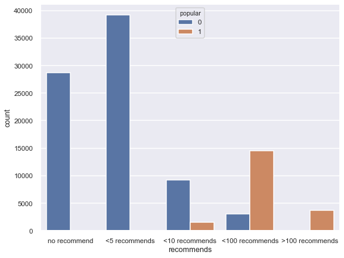
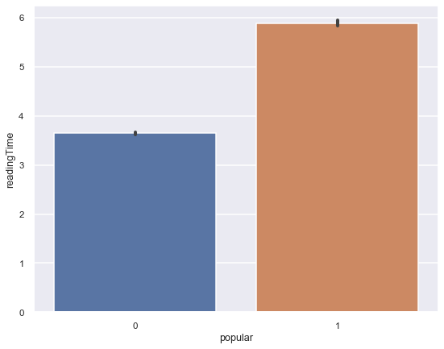
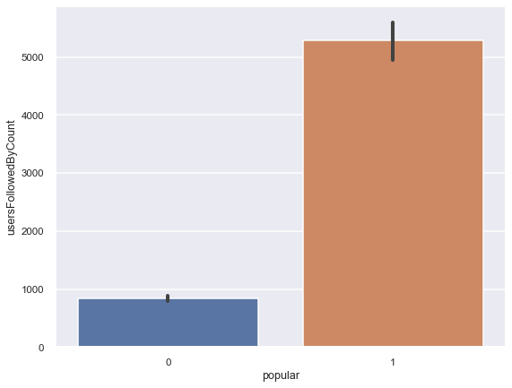

# medium popularity prediction

## outline

Dataset Introduction

Key EDA

KNN, Random Forest and XGboost
Final Model

Conclusion

Future exploration

## project Goal
The above graphic shows hand pumps, cattle troughs, and other pump varieties (red) vs. other communal standpipes types around Tanzania.
This project focus on whether a given article/post on Mediun be popular or not base on certain characteristics.

## Data Collection

The data was collected from Kaggle, originally web scrapped on Medium by Aiswarya. Important features among 50 initial independent variables include:
  -  collectionId
  -  codeBlockCount
  -  imageCount
  -  readingTime
  -  recommends
  -  totalClapCount
  -  wordCount
  -  usersFollowedByCount
  -  usersFollowedCount
## EDA

The above graphic shows recommend counts vs. populatity.

The above graphic shows average reading time vs. populatity.

The above graphic shows follower counts vs. populatity.

https://www.kaggle.com/aiswaryaramachandran/medium-articles-with-content
